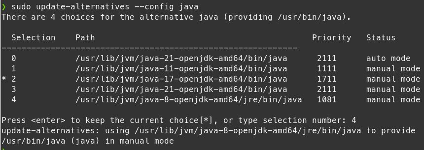

# Linux E-İmza Kurulum Rehberi


`ACS - ACR 38T` Model kart okuyucularının Arch Linux ve Ubuntu işletim sistemleri üzerindeki kullanımı için bu rehberi hazırladım. Farklı linux dağıtımlarını kullandıkça buraya eklemeler yapacağım.

## 1. Java Kurulumu


E-imza araçları Java'nın 8. sürümü ile uyumlu çalışmaktadır.

<details>
<summary><b>Arch Linux</b></summary>

```
sudo pacman -S jdk8-openjdk
```

Kurulumu kontrol edelim
```
java -version
```
</details>

<details>
<summary><b>Ubuntu</b></summary>

```
sudo apt install openjdk-8-jdk
```

Kurulumu kontrol edelim
```
java -version
```
</details>

> [!WARNING]
> Eğer sisteminizde Java'nın farklı sürümleri de varsa aktif sürümü değiştirmeniz gerekir. Bunun için aşağıdaki komutu kullanabilirsiniz.

```
sudo update-alternatives --config java
```



Yukarıdaki komutu çalıştırınca sisteminizde yüklü Java sürümlerinin listesini verip sizden bir sayı istenecek. Başında `*` bulunan satır o anda aktif olan Java sürümünü göstermektedir. Bu aşamada **Java 8**'in bulundğu satır numarasını girip `Enter` tuşuna basarak sürüm değiştirme işlemini tamamlayınız.

> [!TIP]
> Başka programlar güncel Java sürümü isteyebilirler. Bu yöntemle sürümü değiştirip kullanabilirsiniz. Ancak imza atmak için tekrar **Java 8**'i aktif etmelisiniz. 

## 2. E-imza Araçlarını Yükleme

<details>
<summary><b>Arch Linux</b></summary>

Usb Araçlarını kuralım
```
sudo pacman -S usbutils
```
Kart Okuyucu takılımı diye kontrol edelim
```
lsusb
```
PC/SC İstemcisi ve Kütüphaneleri:

ACR 38T kart okuyucusu için gerekli olan libpcsclite paketini yükleyelim
```
sudo pacman -S pcsclite
```
ACR 38T kart okuyucusu için özel bir sürücü gerekebilir. Genellikle, libacsccid gibi bir paket gerekebilir:
```
sudo pacman -S ccid
```
PC/SC servisini başlatmak için:
```
sudo systemctl start pcscd
```
Bu servisin sistem başlangıcında otomatik olarak başlamasını sağlayalım

```
sudo systemctl enable pcscd
```
</details>

<details>
<summary><b>Ubuntu</b></summary>

Kart Okuyucu takılımı diye kontrol edelim
```
lsusb
```
PC/SC İstemcisi ve Kütüphaneleri:

ACR 38T kart okuyucusu için gerekli olan libpcsclite paketini yükleyelim
```
sudo apt install pcscd pcsc-tools
```
Kart okuyucunun bilgisayarına bağlı olduğundan emin olmak için aşağıdaki komutu çalıştırarak okuyucunun tanınıp tanınmadığını kontrol edelim:
```
pcsc_scan
```
</details>

## 3. Atatürk Üniversitesi E-İmza Aracını Kurma

Linux sistemlerinde E-İmza aracı `AtaBaumUbysSigner` `/root` klasörü içinde çalışıyor. Bunun için klasörü buraya kopyalayalım.

> [!IMPORTANT]
> AtaBaumUbysSigner dosyasını [buradan](source/AtaBaumUbysSigner.zip) indirebilirsiniz.

İndirdiğiniz sıkıştırılmış dosyayı çıkardığınız klasörde aşağıdaki komutu çalıştırıp kopyalama işlemini yapalım:  

```
sudo cp -r AtaBaumUbysSigner /root
```
Yetkili kullanıcı moduna girelim
```
sudo su
```
İlgili klasöre geçelim
```
cd /root/AtaBaumUbysSigner/ 
```
`AtaBaumUbysSigner` aracını çalıştıralım
```
java -jar AtaBaumUbysSigner.jar
```
Bu işlemler bittikten sonra, hemen tarayıcınızı yeniden başlatıp ardından imza atabilirsiniz. Eğer ilk çalıştırmada `AtaBaumUbysSigner` kapanırsa yukarıdaki komutla yeniden çalıştırabilirsiniz. 

> [!NOTE]
>Her seferinde çalıştırmak için yukarıdaki adımları uygulayacak bir script kullanabilirsiniz. Örnek scripti [buradan](source/eimza.desktop) indirebilirsiniz. İndirdiğiniz dosyayı çalıştırılabilir hale getirmek için dosyanın bulunduğu klasörde aşağıdaki terminal komutunu çalıştırın
```
chmod +x eimza.desktop
```

> [!TIP]
> Dosya ile işiniz bittiğinde kapatmak için komutun çalıştığı terminalde `Ctrl+C` kısa yolunu kullanabilirsiniz.